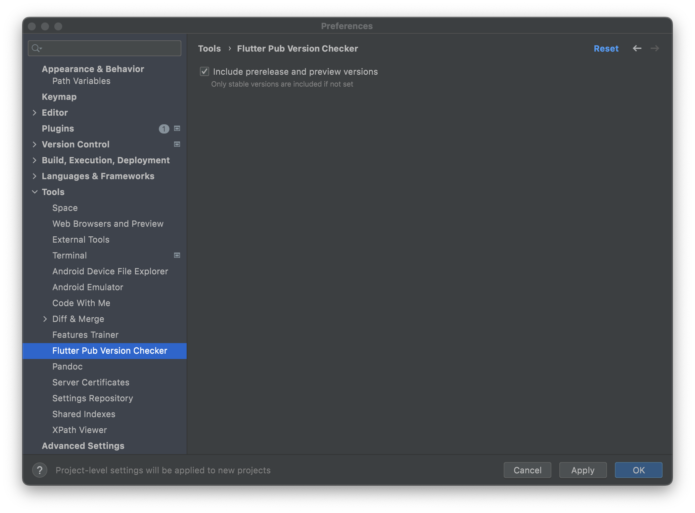

# Flutter Pub Version Checker

<!-- Plugin description -->
This IntelliJ plugin inspects your pubspec.yaml file to find if you're using 
the latest package versions from the [pub.dev](https://pub.dev) - the official 
package repository for Flutter and Dart apps.
<!-- Plugin description end -->

## How to install?

You can install plugin directly from IntelliJ IDEA or Android Studio:
1. Open _Preferences_
2. Choose _Plugins_
3. Select to look for plugins from _Marketplace_
4. Search for **Flutter Pub Version Checker**
5. Tap on Install

## How to use?

Once plugin is installed, go to the pubspec.yaml file. If plugin finds that 
newer version is available, you'll see it highlighted.

To fix that, press Cmd+Enter (Alt+Enter) or click the action indicator to the 
left of the caret to open the action list and choose "Update dependency".

## Configuration

By default, the plugin will only check for the newest stable version in Pub.dev.
To include preview and prerelease versions, in your IDE go to the 
**Settings/Preferences | Tools | Flutter Pub Version Checker** and check 
**"Include prerelease and preview versions"** checkbox:

## What's new?

See [CHANGELOG](CHANGELOG.md) to see what's new.

## How can I help?

Feel free to send [Pull Request](https://github.com/pszklarska/FlutterPubVersionChecker/pulls) or file a new [Issue](https://github.com/pszklarska/FlutterPubVersionChecker/issues)! Or...

### Sponsor this project!

If you like this project and want to support open source activity, consider 
[sponsoring my profile](https://github.com/sponsors/pszklarska) ❤️
